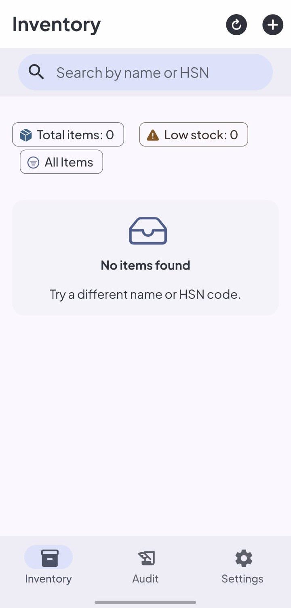

I didn't expect to use **Framework7** or **NativeScript** in 2026.
But yesterday evening, I got a small client requirement: a simple inventory tracking system.

Two roles:

- Admin -> add items, restock, edit/delete, view audit logs.
- Staff -> only deduct/sell items.

## The usual instinct

My first thought was obvious:

- React Native
- or Jetpack Compose

But then I paused. That meant setting up environments, fixing dependencies, dealing with configs, and running `npx expo install --fix` type commands.

And for what? A simple app. I didn't need the best stack; I needed the **fastest path to working software**.

---

## Trying NativeScript

I had seen <a href="https://nativescript.org" target="_blank" rel="noopener noreferrer">NativeScript</a> before in a YouTube video, so I gave it a try.

And honestly,

> NativeScript felt closer to native and more fluid.

The UI felt smooth and the experience was solid.

But...

> It works really well when it works.
> But when it doesn't, you are kind of on your own.

I ran into:

- inconsistent documentation
- outdated packages (6-8 years old)
- issues with font icons not rendering
- styling that isn't exactly standard CSS

I fixed some of it, but it was slowing me down.

And for this project, speed mattered more.

---

## Switching to Framework7

So I switched.

I scaffolded a <a href="https://capacitorjs.com" target="_blank" rel="noopener noreferrer">Capacitor</a> app, added <a href="https://framework7.io" target="_blank" rel="noopener noreferrer">Framework7</a>, and just started building.

And this is where things clicked.

Framework7 already had:

- pull to refresh
- swipeable list items
- infinite scrolling
- built-in toasts, dialogs and alerts
- ready-made UI components like search bar and icons

Everything I needed for this kind of app was already there.

No overthinking.

Just import and use.

## What surprised me

I finished the entire app in **under 3 hours (including testing)**.

Stack:

- Framework7
- Capacitor
- TanStack Query
- Supabase

And the result?

> The UI looked completely like a native Material app.

If I showed it to someone, they'd probably assume it was built with Jetpack Compose.

---

## The tradeoff

Of course:

- NativeScript -> more native feel, smoother
- Framework7 -> runs in WebView with the help of Capacitor.

So yes, NativeScript felt more fluid and performant.

But:

> I didn't need that level of fidelity.

I needed something:

- simple
- fast
- correct

---

## The real lesson

This project reminded me of something important:

> Not every problem needs the best framework.
> It needs the right framework for the constraints.

---

## Final thought

Before I wrap up, one thing I want to say about NativeScript.

Personally, I think the idea behind NativeScript is genuinely unique.

Being able to use JavaScript/TypeScript to directly access native APIs without a heavy bridge layer is a very powerful concept. The team behind it has done some really impressive work.

But at the same time:

> a great idea alone isn’t enough.

The ecosystem and documentation haven’t kept up, and that makes it hard to rely on in real-world scenarios where time matters.

That said, I would still consider using it for future projects — especially when I have more time.

The idea and execution behind NativeScript are too unique to ignore.

---

Most clients don’t need complex systems.

They don’t care about:

- architecture purity
- cutting-edge stacks

They care about:

> something that works consistently and fits into their workflow.

---

And sometimes, the tools that help you do that fastest
are the ones people stopped talking about.
